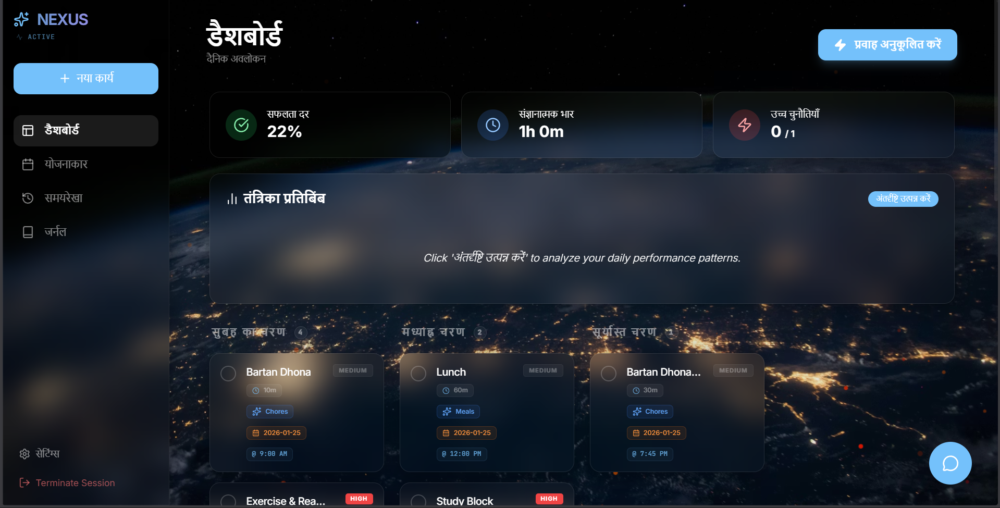
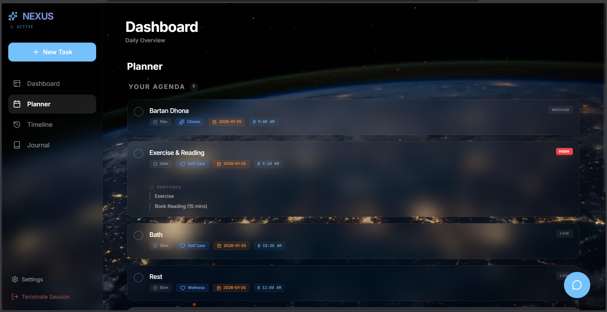
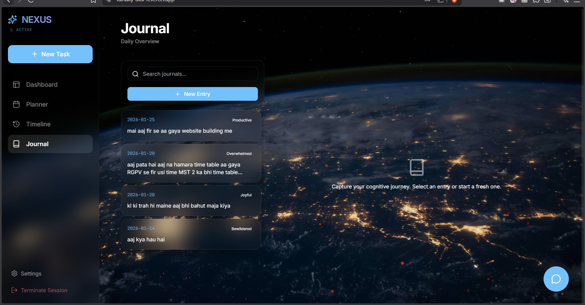
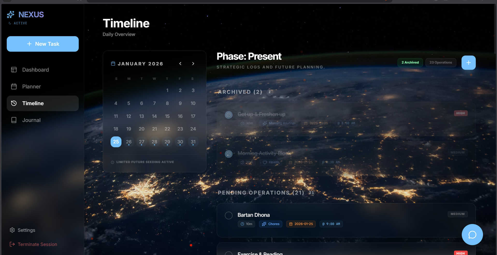

🧠 Nexus AI Scheduler

A deeply thought-out AI-powered task & productivity system

🔗 Live App: https://fainally-didi-it.vercel.app

🧩 Why I Built This

Most task apps fail at future task management.

They either:

Mix future tasks with today’s tasks

Break state when editing timelines

Lose context when AI generates tasks

Or overwrite tasks unintentionally

I built Nexus AI Scheduler to solve one core problem:

“How can an AI reliably manage today’s tasks AND future tasks without breaking UI state, timelines, or user intent?”

This project focuses heavily on state isolation, predictable scheduling, and AI safety in task generation.

📸 Screenshots (Actual Working)

🚀 Core Features (Explained Deeply)
🤖 AI-Generated Task Handling

Users can paste unstructured schedules (paragraphs, routines, lists)

AI converts them into structured tasks

Tasks are safely validated before storage

Prevents duplicate or malformed task creation

Why this matters:
AI output is unpredictable — this app contains and sanitizes AI behavior.

📅 Future Task Isolation (Key Feature)

Future tasks:

Are stored separately

Do not depend on today’s task state

Automatically appear when date & time conditions are met

Are immune to edits made to current-day tasks

This prevents:

Timeline corruption

Accidental overwrites

UI inconsistencies

⏱️ Timeline-Based Planner

Tasks are visualized by time blocks

Planner dynamically updates as tasks move from future → present

Clean separation between:

Today

History

Upcoming

📊 Analytics & History Engine

Completed tasks are archived

Productivity trends are visible

Enables reflection instead of just task dumping

📓 Journal Integration

Daily notes + productivity logs

Encourages intentional planning

Designed to coexist with task flow (not distract from it)

🔐 Authentication & Data Safety

Secure authentication flow

User data isolated

No task leakage between sessions

🧠 Architecture Decisions (Important)
State Isolation Strategy

Current tasks and future tasks never share state

UI updates are scoped to the active timeline

Prevents cascading re-renders

Supabase Usage

Tasks stored with:

Date

Time

Status

Source (AI / Manual)

Queries are time-aware

Future tasks fetched conditionally

Why I Didn’t Use Firestore

Needed predictable relational behavior

Supabase provided clearer control over timeline logic

🛠 Tech Stack (Why Each Choice)
Layer	Technology	Reason
Frontend	React + TypeScript	Predictable UI & type safety
Styling	Custom UI + Glassmorphism	Visual clarity without clutter
Backend	Supabase	Structured queries & auth
AI	Gemini	Natural language task parsing
Hosting	Vercel	Fast deploy & preview workflows
📂 Project Structure (Explained)
nexus-ai-scheduler/
├── components/
│   ├── TaskList.tsx        # Core task rendering
│   ├── EditTaskModal.tsx  # Controlled task edits
│   ├── AnalyticsView.tsx  # Productivity insights
│   ├── HistoryView.tsx    # Archived tasks
│   ├── JournalView.tsx    # Daily notes
│   └── BackgroundEffects.tsx
├── App.tsx                # State orchestration
├── metadata.json          # App configuration
├── models_full_dump.json  # AI schema & logic

⚙️ Local Setup
git clone https://github.com/PriyanshuKeshawani/fainally-didi-it.git
cd nexus-ai-scheduler
npm install
npm run dev

Environment Variables
VITE_SUPABASE_URL=your_supabase_url
VITE_SUPABASE_ANON_KEY=your_public_key

🧪 Edge Cases I Solved

Editing today’s tasks doesn’t modify future schedules

AI hallucinations are sanitized

Time-zone consistency

Responsive UI without layout shifts

Task rendering order stability

📈 Planned Enhancements

🔁 Recurring tasks

🔔 Notifications & reminders

📆 Calendar sync

🧠 Smarter AI confirmations before saving

This project reflects:

My interest in AI safety

My focus on state correctness

My belief that productivity tools should be predictable, not overwhelming

Built as a real system, not a demo.

⭐ Final Note

If this project helped or inspired you:

⭐ Star the repo

🐛 Open issues

💡 Suggest improvements
