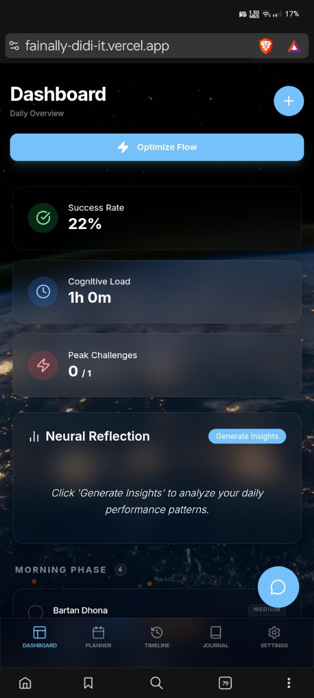

# 🧠 Nexus AI Scheduler  
*A deeply thought-out AI-powered task & productivity system*

🔗 **Live App:** https://fainally-didi-it.vercel.app

---

## 🧩 Why I Built This

Most task and productivity apps struggle with **future task management**.

They often:
- Mix future tasks with today’s tasks  
- Break state when timelines are edited  
- Lose context when AI generates tasks  
- Accidentally overwrite tasks  

I built **Nexus AI Scheduler** to solve one core problem:

> **How can an AI reliably manage today’s tasks and future tasks without breaking UI state, timelines, or user intent?**

This project focuses on **state isolation**, **predictable scheduling**, and **safe AI task generation**.  
It is built as a real system, not a demo.

---

## 📸 Screenshots (Actual Working UI)





---

## 🚀 Core Features

### 🤖 AI-Generated Task Handling
- Paste unstructured schedules (paragraphs, routines, lists)
- AI converts them into structured, time-based tasks
- Tasks are validated before storage
- Prevents duplicate or malformed tasks  

**Why this matters:** AI output is unpredictable. This system contains and controls AI behavior.

---

### 📅 Future Task Isolation (Key Feature)
Future tasks:
- Are stored separately
- Do not depend on today’s task state
- Automatically appear when date & time conditions are met
- Are immune to edits made to current-day tasks  

This prevents timeline corruption, accidental overwrites, and UI inconsistencies.

---

### ⏱️ Timeline-Based Planner
- Tasks visualized in time blocks
- Dynamic movement from future → present
- Clear separation between Today, Upcoming, and History

---

### 📊 Analytics & History
- Completed tasks are archived
- Productivity patterns become visible
- Encourages reflection, not task overload

---

### 📓 Journal Integration
- Daily notes and productivity logs
- Designed to support focus, not distraction

---

### 🔐 Authentication & Data Safety
- Secure authentication flow
- Isolated user data
- No task leakage between sessions

---

## 🧠 Architecture Decisions

### State Isolation Strategy
- Current tasks and future tasks never share state
- UI updates are scoped to active timelines
- Prevents cascading re-renders

### Supabase Usage
Tasks are stored with:
- Date
- Time
- Status
- Source (AI / Manual)

Queries are time-aware, and future tasks are fetched conditionally.

### Why Not Firestore
Predictable relational behavior and clearer timeline control were required. Supabase fit this better.

---

## 🛠 Tech Stack

| Layer      | Technology              | Reason                                  |
|------------|-------------------------|------------------------------------------|
| Frontend   | React + TypeScript      | Predictable UI behavior and type safety |
| Styling    | Custom UI (Glassmorphism) | Clean visuals without visual clutter    |
| Backend    | Supabase                | Structured queries and built-in auth    |
| AI         | Gemini                  | Natural language task parsing           |
| Hosting    | Vercel                  | Fast deployments and preview workflows |

## 📂 Project Structure

```
fainally-didi-it/
├── components/
│   ├── AnalyticsView.tsx        # Productivity analytics & insights UI
│   ├── Auth.tsx                 # Authentication UI & session handling
│   ├── BackgroundEffects.tsx    # Glassmorphism & background animations
│   ├── EditTaskModal.tsx        # Safe task editing modal
│   ├── GlassCard.tsx            # Reusable glassmorphism UI card
│   ├── HistoryView.tsx          # Completed tasks archive
│   ├── JournalView.tsx          # Daily journal & reflections
│   ├── SettingsModal.tsx        # App & user settings modal
│   └── TaskList.tsx             # Core task rendering & timeline logic
│
├── services/
│   ├── geminiService.ts         # AI task generation (Gemini integration)
│   └── supabaseClient.ts        # Supabase client (DB + Auth)
│
├── .env.local                   # Environment variables (not committed)
├── .gitattributes               # Git attributes configuration
├── .gitignore                   # Ignored files & folders
│
├── App.tsx                      # Global state orchestration
├── README.md                    # Project documentation
├── index.html                   # HTML entry point
├── index.tsx                    # React application bootstrap
│
├── models.ts                    # TypeScript models & interfaces
├── metadata.json                # App metadata & configuration
├── models_full_dump.json        # AI schemas, prompts & parsing rules
│
├── package-lock.json             # Dependency lockfile
├── package.json                 # Project dependencies & scripts
├── test_models.ts               # Model-level test cases
├── test_old_tasks.ts            # Legacy task behavior tests
├── tsconfig.json                # TypeScript configuration
├── types.ts                     # Global shared types
└── vite.config.ts               # Vite build & dev configuration

```

## ⚙️ Local Setup

```bash
git clone https://github.com/PriyanshuKeshawani/fainally-didi-it.git
cd nexus-ai-scheduler
npm install
npm run dev
```

## 🧪 Edge Cases Solved
Editing today’s tasks does not affect future tasks

AI hallucinations are sanitized

Time-zone consistency

Stable rendering order

Fully responsive UI without layout shifts

📈 Planned Enhancements
🔁 Recurring tasks

🔔 Notifications & reminders

📆 Calendar sync

🧠 Smarter AI confirmations

## 🧑‍💻 Personal Note
This project reflects my interest in AI safety, state correctness, and building productivity tools that are predictable, not overwhelming.

Built as a real system.

## """⭐ Final Note """
If this project helped or inspired you:

⭐ Star the repo

🐛 Open issues

💡 Suggest improvements
